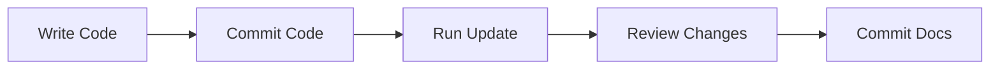

# Cursor IDE Integration Guide

## 🎯 Quick Commands in Cursor

### Method 1: Terminal Commands (Easiest)

Open terminal in Cursor (`` Ctrl+` `` or `Cmd+` ``) and run:

```bash
# First time setup
./scripts/wiki-init.sh

# Update after changes
./scripts/wiki-update.sh

# Validate quality
./scripts/wiki-validate.sh
```

### Method 2: Tasks Menu (Most Convenient)

1. Press `Cmd+Shift+P` (Mac) or `Ctrl+Shift+P` (Windows/Linux)
2. Type "Tasks: Run Task"
3. Select one of:
   - **📚 Wiki: Initialize (First-Time Setup)**
   - **🔄 Wiki: Update (After Code Changes)** ⭐ Most used
   - **✅ Wiki: Validate (Quality Check)**
   - **🏗️ MkDocs: Build**
   - **👀 MkDocs: Serve**

### Method 3: Keyboard Shortcuts (Fastest)

Add to your `.vscode/keybindings.json` (or global keybindings):

```json
[
  {
    "key": "cmd+shift+w u",
    "command": "workbench.action.tasks.runTask",
    "args": "🔄 Wiki: Update (After Code Changes)"
  },
  {
    "key": "cmd+shift+w v",
    "command": "workbench.action.tasks.runTask",
    "args": "✅ Wiki: Validate (Quality Check)"
  },
  {
    "key": "cmd+shift+w s",
    "command": "workbench.action.tasks.runTask",
    "args": "👀 MkDocs: Serve"
  }
]
```

Then use:
- `Cmd+Shift+W U` - Update docs
- `Cmd+Shift+W V` - Validate
- `Cmd+Shift+W S` - Serve locally

---

## 📋 Recommended Workflow in Cursor

### Daily Development Flow



**In Cursor:**

1. **Write your code** as normal
2. **Commit code changes:**
   ```bash
   git add src/
   git commit -m "feat: new feature"
   ```
3. **Update documentation:**
   - Press `Cmd+Shift+P` → "Tasks: Run Task" → "🔄 Wiki: Update"
   - Or: `./scripts/wiki-update.sh`
4. **Review changes:**
   - Open `docs/` folder in Cursor
   - Check git diff: `git diff docs/`
5. **Commit documentation:**
   ```bash
   git add docs/ .repo_wiki/
   git commit -m "docs: update for new feature"
   ```

---

## 🔍 Cursor Features to Use

### 1. Split View for Skill Reading

When running workflows, split your Cursor window:

1. **Left pane**: Terminal running workflow script
2. **Right pane**: Open `skills/repo-wiki-*/SKILL.md` files
3. Follow instructions side-by-side

**Keyboard shortcut:** `Cmd+\` to split editor

### 2. Search in Skills

Use Cursor's search to find specific instructions:

1. Press `Cmd+Shift+F` (global search)
2. Search in: `skills/`
3. Examples:
   - Search "citation format" to find citation specs
   - Search "troubleshooting" for help
   - Search "configuration" for config options

### 3. File Watchers

Cursor will auto-detect changes in:
- `docs/` - Documentation files
- `.repo_wiki/` - State files
- `mkdocs.yml` - Configuration

You'll see file changes highlighted in the explorer.

### 4. Git Integration

Use Cursor's built-in Git features:

- **Source Control panel** (`Cmd+Shift+G`) shows:
  - Modified docs
  - New component pages
  - Updated citations
- **Diff view**: Click any changed file to see what the agent updated
- **Commit**: Stage and commit directly from Cursor

### 5. Preview Documentation

While `mkdocs serve` is running:

1. Open browser to http://localhost:8000
2. Edit docs in Cursor
3. See live updates in browser
4. Split screen: Cursor + Browser

---

## 🛠️ Setup in Cursor

### First-Time Cursor Setup

1. **Clone/Open repository:**
   ```bash
   cd /path/to/repo
   cursor .
   ```

2. **Verify uv:**
   - Open terminal in Cursor
   - Run: `uv --version`

3. **Install MkDocs:**
   ```bash
   pip install mkdocs-material
   ```

4. **Make scripts executable:**
   ```bash
   chmod +x scripts/*.sh
   chmod +x skills/repo-wiki/scripts/*.py
   ```

5. **Run first workflow:**
   - Press `Cmd+Shift+P`
   - "Tasks: Run Task"
   - "📚 Wiki: Initialize"

### Workspace Settings

The `.vscode/` folder contains:
- **tasks.json** - Pre-configured tasks
- **settings.json** - Workspace preferences

These are included in the repository and work automatically.

---

## 💡 Tips & Tricks

### Tip 1: Use AI Chat with Skills

In Cursor's AI chat:

```
@skills/repo-wiki/SKILL.md explain how citations work
```

The AI can read skills and answer questions!

### Tip 2: Quick Preview

Add to your shell profile:

```bash
alias wiki-serve='cd $(git rev-parse --show-toplevel) && mkdocs serve'
```

Then just type `wiki-serve` anywhere in your repo.

### Tip 3: Pre-commit Hook

Create `.git/hooks/pre-commit`:

```bash
#!/bin/bash
# Auto-validate docs before commit
if [ -d ".repo_wiki" ]; then
  ./scripts/wiki-validate.sh
  exit $?
fi
```

### Tip 4: Status Bar

Add to Cursor status bar with an extension or use terminal:

```bash
# Check if docs are up to date
git diff --quiet docs/ || echo "⚠️ Docs need commit"
```

### Tip 5: Multi-Repo

Working with multiple repos? Use Cursor workspaces:

1. File → Add Folder to Workspace
2. Add all your repos
3. Run wiki commands in each repo's terminal

---

## 🚨 Troubleshooting in Cursor

### Scripts Won't Run

**Problem:** "Permission denied"

**Solution:**
```bash
chmod +x scripts/*.sh
chmod +x skills/repo-wiki/scripts/*.py
```

### Tasks Not Showing

**Problem:** Tasks menu is empty

**Solution:**
1. Check `.vscode/tasks.json` exists
2. Reload window: `Cmd+Shift+P` → "Reload Window"

### Python Scripts Fail

**Problem:** "uv: command not found"

**Solution:**
1. Install uv: `curl -LsSf https://astral.sh/uv/install.sh | sh`
2. Restart Cursor
3. Check terminal: `which uv`

### MkDocs Build Fails

**Problem:** "mkdocs: command not found"

**Solution:**
```bash
pip install mkdocs-material
# Or with conda:
conda install -c conda-forge mkdocs-material
```

### Git Issues

**Problem:** "Not a git repository"

**Solution:**
```bash
git init
git add .
git commit -m "Initial commit"
```

---

## 📊 Monitoring in Cursor

### Watch Files

Keep these files open in Cursor tabs for monitoring:

1. **`.repo_wiki/state.json`** - Current commit, last update time
2. **`.repo_wiki/change_set.json`** - Detected changes (after detect)
3. **`.repo_wiki/validation_report.md`** - Validation results
4. **`.repo_wiki/logs/update.log`** - Update history

### Terminal Output

Terminal outputs are color-coded:
- ✅ Green checkmark = Success
- ❌ Red X = Error
- ⚠️ Yellow warning = Warning

### Progress Indicators

Scripts show progress:
```
Step 1/4: Initializing...
Step 2/4: Indexing...
Step 3/4: Generating...
Step 4/4: Validating...
```

---

## 🎨 Customization

### Custom Keybindings

Add your own shortcuts in `.vscode/keybindings.json`:

```json
[
  {
    "key": "f5",
    "command": "workbench.action.tasks.runTask",
    "args": "🔄 Wiki: Update (After Code Changes)"
  }
]
```

### Custom Tasks

Add to `.vscode/tasks.json`:

```json
{
  "label": "Wiki: Quick Validate",
  "type": "shell",
  "command": "uv run skills/repo-wiki/scripts/validate_citations.py"
}
```

### Snippets

Create markdown snippets for citations in `.vscode/markdown.json`:

```json
{
  "Citation Footnote": {
    "prefix": "cite",
    "body": [
      "[$1]($2#L$3-L$4)"
    ]
  }
}
```

---

## 📚 Learning Path

### Week 1: Basics
1. Run `wiki-init.sh` on a test repo
2. Explore generated `docs/` structure
3. Run `mkdocs serve` and browse docs
4. Make a small code change
5. Run `wiki-update.sh` to see incremental updates

### Week 2: Daily Usage
1. Use update workflow after each feature
2. Review validation reports
3. Customize `.repo_wiki/config.json`
4. Add custom templates

### Week 3: Advanced
1. Create custom templates
2. Set up CI/CD integration
3. Customize component detection
4. Fine-tune citation coverage

---

## 🎯 Best Practices in Cursor

1. **Keep terminal open** - Always have a Cursor terminal running
2. **Use tasks** - Faster than typing commands
3. **Split view** - Terminal + Skill instructions
4. **Commit often** - Small doc updates are easier to review
5. **Validate before push** - Always run validate before pushing
6. **Preview locally** - Use `mkdocs serve` to check output
7. **Use git diff** - Review what the agent changed
8. **Read skills** - Skills have troubleshooting sections

---

## 🆘 Getting Help

1. **In Cursor:**
   - Open skill files: `skills/repo-wiki/*/SKILL.md`
   - Search for keywords
   - Use Cursor AI to explain skills

2. **Terminal:**
   ```bash
   # View main skill
   cat skills/repo-wiki/SKILL.md
   
   # View specific skill
   cat skills/repo-wiki-update/SKILL.md
   
   # Check logs
   cat .repo_wiki/logs/update.log
   ```

3. **Documentation:**
   - `README.md` - Full guide
   - `QUICK_START.md` - Fast start
   - `IMPLEMENTATION_SUMMARY.md` - Technical details

---

Enjoy using Repo Wiki Agent Skills in Cursor! 🚀
